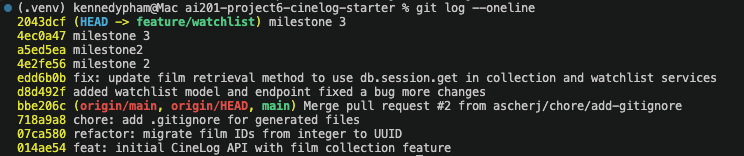

# PR Response Doc — CineLog Watchlist Feature

## AI Usage

I used AI tools to help orient myself within the unfamiliar codebase by comparing the watchlist service with the existing collection service. In particular, I used AI to identify the project's naming, deduplication, testing, and error-handling patterns, then verified those observations directly against the source files.

I also used AI to review my proposed conventional commit messages and to stress-test my reasoning for the visibility and sort-order decisions. I kept the final decisions grounded in CineLog's existing behavior and the maintainer's review comments rather than copying a generic recommendation.

## Comment 1 — Rename

**What I did:**
Renamed `save_to_watchlist()` to `add_to_watchlist()` in the watchlist service to match the project's existing `verb_to_noun` naming convention. I also updated the import and call site in `routes/watchlist.py`.

**How I verified:**
I used a project-wide search for `save_to_watchlist` to confirm no old references remained. I then ran `pytest tests/ -v` to verify that the existing test suite still passed.

## Comment 2 — Deduplication

**What I did:**
Added an `AlreadyInWatchlistError` exception and a duplicate-entry check inside `add_to_watchlist()`. After confirming that the film exists, the service searches for an existing `WatchlistEntry` with the same `user_id` and `film_id`. If one exists, the service raises the new exception instead of creating another row. I also updated the route to return HTTP 409 for duplicate requests.

**How I verified:**
I compared the implementation with the existing `add_to_collection()` pattern and confirmed that both perform the existence check before the duplicate check. I ran the full test suite with `pytest tests/ -v`.

## Comment 3 — Missing test

**What I did:**
Created `tests/test_watchlist.py` and added `test_add_to_watchlist_nonexistent_film_raises`. The test creates an isolated in-memory database and a sample user, then verifies that passing a nonexistent UUID to `add_to_watchlist()` raises `FilmNotFoundError`.

**How I verified:**
I modeled the fixture and assertion structure after `test_add_to_collection_nonexistent_film_raises` in `tests/test_collection.py`. I ran `pytest tests/test_watchlist.py -v` and then the complete suite with `pytest tests/ -v`.

## Comment 4 — Default visibility

**My position:**
I would keep `public=True` as the default for watchlist entries.

**Reasoning:**
CineLog is a social film-tracking application, so public watchlists support film discovery and interaction between users. Keeping the default public also makes the basic add-to-watchlist request simpler because callers do not need to provide a visibility value every time.

A watchlist represents films a user is interested in watching, and sharing that interest can help friends recommend films or plan what to watch together.

**Tradeoff acknowledged:**
A public default creates a privacy concern because some users may not expect their future viewing interests to be visible automatically. A private default would better protect those users, but it would reduce the social and discovery benefits of CineLog. A future improvement would allow users to choose an account-level default and override it for individual watchlist entries.

## Comment 5 — Sort order

**My position:**
I accepted the maintainer's recommendation and changed the watchlist from alphabetical order to date-added order, newest first.

**Reasoning:**
The films added most recently are likely to be the ones the user is currently most interested in watching. Showing those entries first helps users quickly find their newest choices.

This also matches `get_collection()`, which sorts collection entries by `date_added` descending. Using the same ordering behavior makes CineLog's collection and watchlist features more consistent.

**Engagement with reviewer's point:**
Alphabetical order is predictable and can make a large watchlist easier to scan by title. However, it removes the context of when a film was added. I agreed that recency is more useful as the default because a watchlist changes over time. Alphabetical sorting could later be offered as an optional sorting choice.

## Comment 6 — Rebase

**What conflicted:**
The watchlist branch was created before the main branch migrated film IDs from integers to UUID strings. The watchlist model and documentation still referenced integer film IDs, which conflicted with the updated UUID-based models on main.

**How I resolved it:**
I preserved the watchlist feature while adopting the UUID definitions from the updated main branch. I made sure the watchlist entry's `film_id` foreign key used `String(36)` and updated the service and route documentation to describe film IDs as UUID strings. I also preserved the rename, deduplication logic, error handling, tests, and newest-first sorting from the feature branch.

**How I verified no conflict remains:**
I completed the rebase with `git rebase --continue`, searched the repository for unresolved conflict markers and outdated integer film ID references, and ran the full test suite with `pytest tests/ -v`. I also ran `git rev-list --merges` against the updated main branch and confirmed that no merge commits remained.

## Final Commit History

The following screenshot shows the cleaned commit history after the interactive rebase. Each commit represents one logical change, uses conventional commit format, and the branch contains no merge commits.



## PR Description

### Overview

This pull request completes the CineLog watchlist feature and addresses all six review comments. It renames the service function to match project conventions, prevents duplicate watchlist entries, adds missing test coverage, updates watchlist handling for UUID-based film IDs, and rebases the feature branch onto the latest main branch.

### Design decisions

- **Visibility default:** Watchlist entries remain public by default because CineLog is a social film-tracking platform and public watchlists support discovery and interaction. The privacy tradeoff is acknowledged, and a future account-level default could give users more control.
- **Sort order:** Watchlist entries are sorted by date added, newest first. This makes recently added films easier to find and matches the ordering used by the collection feature.

### Manual testing

1. Create and activate the virtual environment.
2. Install dependencies with `pip install -r requirements.txt`.
3. Run the test suite with `pytest tests/ -v`.
4. Start the application with `python app.py`.
5. Retrieve a user's watchlist with:

   ```bash
   curl http://127.0.0.1:5000/watchlist/<user_id>
